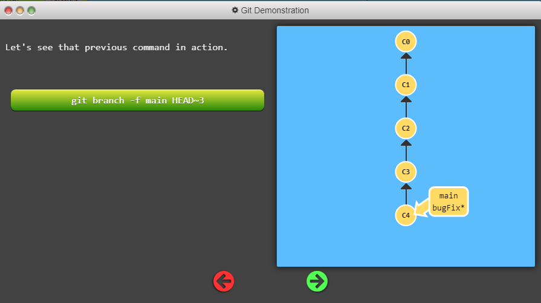

# Git

Practicising from Git Learning website [https://learngitbranching.js.org/](https://learngitbranching.js.org/)

## Git Commit

> $ git commit

It create a new commit and main is move to new commit

## Branch

> $ git branch newImage

New branch is created here with the name of `newImage`. Here `$ git branch <branchName>`

Here with that same commit both main and newImage branch are present

> $ git commit

If you do `git commit` the main branch is move ahead with new commit and newImage branch is stay with old commit

Oh! no, but we want to move with `newImage` not with main `branch`

So we have to use `checkout`, this is used to change branch from one to another with branch name
`$ git checkout <branchName>`

> $ git checkout newImage; git commit;

Now new commit is moved with `newImage branch`

NOTE:-  
In Git version 2.23, a new command called `git switch` was introduced to eventually replace `git checkout`, which is somewhat overloaded (it does a bunch of different things depending on the arguments). The lessons here will still use `checkout` instead of `switch` because the `switch` command is still considered experimental and the syntax may change in the future. However you can still try out the new `switch` command in this application, and also [learn more here.](https://git-scm.com/docs/git-switch)

Ok! You are all ready to get branching. Once this window closes, make a new branch named `bugFix` and switch to that branch.

By the way, here's a shortcut: if you want to create a new branch AND check it out at the same time, you can simply type `git checkout -b <yourbranchname>`.

> git checkout -b bugFix

## Merging in Git

Great! We now know how to commit and branch. Now we need to learn some kind of way of combining the work from two different branches together. This will allow us to branch off, develop a new feature, and then combine it back in.

The first method to combine work that we will examine is git `merge`. Merging in Git creates a special commit that has two unique parents. A commit with two parents essentially means "I want to include all the work from this parent over here and this one over here, and the set of all their parents."

It's easier with visuals, let's check it out in the next view.

Here we have two branches; each has one commit that's unique. This means that neither branch includes the entire set of "work" in the repository that we have done. Let's fix that with merge.

We will `merge` the branch `bugFix` into `main`.

> $ git merge bugfix

Here what's happening, commit is going to `main` and `bugfix` is not merging with `main`. So to do that, we will be using below command.

> $ git checkout bugfix; git merge main

Since `bugFix` was an ancestor of `main`, git didn't have to do any work; it simply just moved `bugFix` to the same commit `main` was attached to.

## Git Rebase

The second way of combining work between branches is rebasing. Rebasing essentially takes a set of commits, "copies" them, and plops them down somewhere else.

While this sounds confusing, the advantage of rebasing is that it can be used to make a nice linear sequence of commits. The commit log / history of the repository will be a lot cleaner if only rebasing is allowed.


## Head

First we have to talk about "HEAD". HEAD is the symbolic name for the currently checked out commit -- it's essentially what commit you're working on top of.

HEAD always points to the most recent commit which is reflected in the working tree. Most git commands which make changes to the working tree will start by changing HEAD.

Normally HEAD points to a branch name (like bugFix). When you commit, the status of bugFix is altered and this change is visible through HEAD.

Try this one

---


> $ git checkout C1; git checkout main; git commit; git checkout c2

### Detaching Head


if type below command

> $ git checkout c1

And now it's

HEAD -> C1

To complete this level, let's detach HEAD from `bugFix` and attach it to the commit instead.
Specify this commit by its hash. The hash for each commit is displayed on the circle that represents the commit.


```html
<!-- SOLUTION -->
git checkout c4
```

### Relative Refs

Moving around in Git by specifying commit hashes can get a bit tedious. In the real world you won't have a nice commit tree visualization next to your terminal, so you'll have to use `git log` to see hashes.

Furthermore, hashes are usually a lot longer in the real Git world as well. For instance, the hash of the commit that introduced the previous level is `fed2da64c0efc5293610bdd892f82a58e8cbc5d8`. Doesn't exactly roll off the tongue...

The upside is that Git is smart about hashes. It only requires you to specify enough characters of the hash until it uniquely identifies the commit. So I can type `fed2` instead of the long string above.

Like I said, specifying commits by their hash isn't the most convenient thing ever, which is why Git has relative refs. They are awesome!

With relative refs, you can start somewhere memorable (like the branch `bugFix` or `HEAD`) and work from there.

Relative commits are powerful, but we will introduce two simple ones here:

Moving upwards one commit at a time with `^`
Moving upwards a number of times with `~<num>`


=====================================================================================

> $ git checkout main^

NOTE:- Here `main` does not move upwards only `HEAD` move upwards. And `main` still stay there.

====================================================================================


### Exercise Relative ref


### "~" operator

The "~" operator
Say you want to move a lot of levels up in the commit tree. It might be tedious to type `^`several times, so Git also has the tilde (~) operator.

The tilde operator (optionally) takes in a trailing number that specifies the number of parents you would like to ascend. Let's see it in action.


## Branch forcing

You're an expert on relative refs now, so let's actually use them for something.

One of the most common ways I use relative refs is to move branches around. You can directly reassign a branch to a commit with the `-f` option. So something like:

`git branch -f main HEAD~3`

moves (by force) the main branch to three parents behind HEAD.




Now that you have seen relative refs and branch forcing in combination, let's use them to solve the next level.
To complete this level, move `HEAD`, `main`, and `bugFix` to their goal destinations shown.


```html
<!-- SOLUTION -->
git branch -f main c6; git branch -f bugFix c0; git checkout c1
```

Note:-

- Use `git branch -f main c4` to MOVE `main` forcely to `c4` commit hash
- Use `git checkout` only works on `HEAD` not on branches

## Reversing Changes in Git

There are many ways to reverse changes in Git. And just like committing, reversing changes in Git has both a low-level component (staging individual files or chunks) and a high-level component (how the changes are actually reversed). Our application will focus on the latter.

There are two primary ways to undo changes in Git -- one is using `git reset` and the other is using `git revert`. We will look at each of these in the next dialog

### Git Reset


### Git Revert


### Reverse exercise

To complete this level, reverse the most recent commit on both `local` and `pushed`. You will revert two commits total (one per branch).

Keep in mind that `pushed` is a remote branch and `local` is a local branch -- that should help you choose your methods.


```html
<!-- SOLUTION -->

git reset local^; git checkout pushed; git revert pushed;
```

## Moving Work Around
